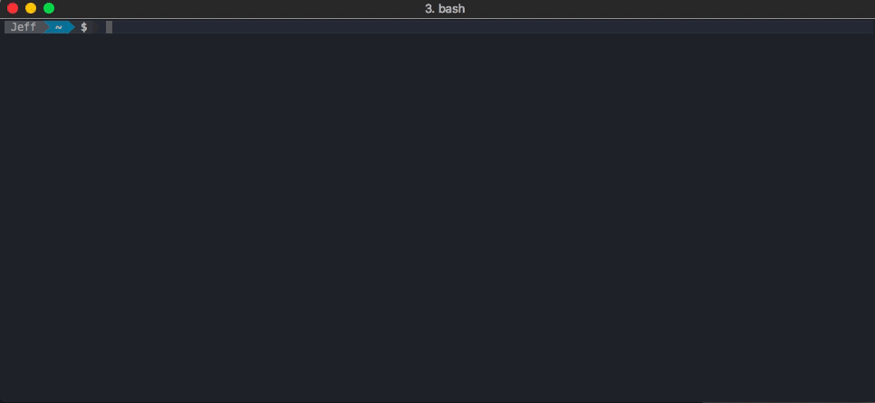

## Readme

Readme prints out the github readme file for a repository with simple markdown header and
code block highlighting 



## Usage

```bash
readme username/repository
```

## Installation

```bash
go get github.com/deltaskelta/readme
```
